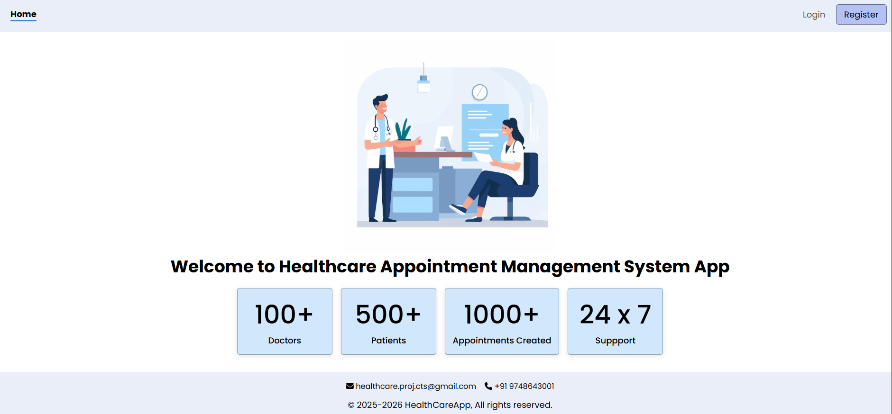
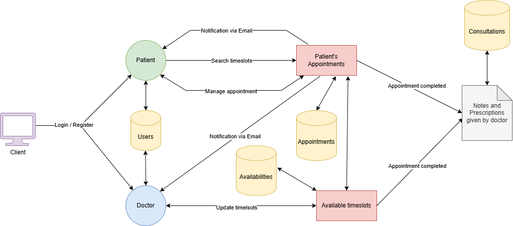
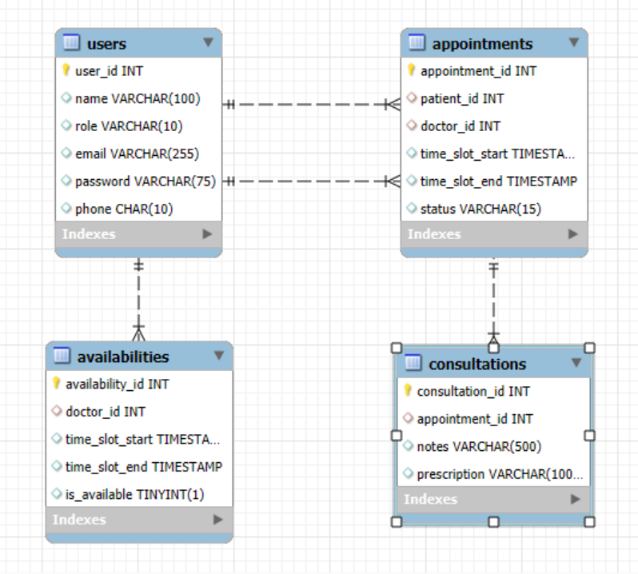

# Smart Healthcare Appointment System

## Overview

The **Smart Healthcare Appointment System** is a full-stack application built to simplify and optimize the management of healthcare appointments. Leveraging Spring Boot for the backend and Angular for the frontend, it offers a secure and responsive platform for managing patient and doctor interactions, scheduling appointments, maintaining consultation records, and monitoring doctor availability. Automated notifications ensure timely reminders using CRON jobs and Java Mail Sender.

## 

## 

## Features

- **User Management**:
  - Patients and doctors can register, log in, and manage profiles.
- **Appointment Scheduling**:
  - Patients can book, update, and cancel appointments.
  - Doctor availability is seamlessly integrated.
- **Consultation Records**:
  - Securely store consultation notes, prescriptions, and medical history.
- **Doctor Availability Management**:
  - Doctors can set availability and block unavailable time slots.
- **Notifications**:
  - Automated reminders and updates via email.

---

## Tech Stack

- **Programming Language**: Java (JDK 21)
- **Backend Framework**: Spring Boot (`http://localhost:8080`)
- **Frontend Framework**: Angular (v19+) (`http://localhost:4200`)
- **Database**: MySQL
- **Build Tool**: Maven
- **Validation**: Jakarta Validation API
- **Additional Tools**:
  - Lombok for simplifying boilerplate code.
  - Spring Data JPA for database interactions.
  - Java Mail Sender for email notifications.

---

## Architecture

- **Backend**:
  - RESTful API with a layered architecture (Controller → Service → Repository).
  - Business logic is encapsulated within the service layer.
  - Secure user authentication using **JWT (JSON Web Tokens)**.
- **Database**:
  - MySQL for data persistence.
- **Notifications**:
  - CRON jobs integrated for email automation.

---

## Backend API Endpoints

### 1. User Management

| Endpoint          | Method | Description                   |
| ----------------- | ------ | ----------------------------- |
| `/users`          | GET    | Fetch all users               |
| `/users/{id}`     | GET    | Fetch user by ID              |
| `/users/register` | POST   | Register a new user           |
| `/users/login`    | POST   | Authenticate an existing user |
| `/users`          | PUT    | Update user profile           |
| `/users/{id}`     | DELETE | Delete user by ID             |

---

### 2. Appointment Scheduling

| Endpoint                      | Method | Description                   |
| ----------------------------- | ------ | ----------------------------- |
| `/appointments`               | GET    | Fetch all appointments        |
| `/appointments/{id}`          | GET    | Fetch appointment by ID       |
| `/appointments`               | POST   | Create a new appointment      |
| `/appointments/cancel/{id}`   | PUT    | Cancel an appointment         |
| `/appointments/complete/{id}` | PUT    | Mark appointment as completed |

---

### 3. Consultation Records

| Endpoint              | Method | Description                 |
| --------------------- | ------ | --------------------------- |
| `/consultations`      | GET    | Fetch all consultations     |
| `/consultations/{id}` | GET    | Fetch consultation by ID    |
| `/consultations`      | POST   | Create a new consultation   |
| `/consultations`      | PUT    | Update consultation details |
| `/consultations/{id}` | DELETE | Delete consultation by ID   |

---

### 4. Doctor Availability

| Endpoint               | Method | Description                    |
| ---------------------- | ------ | ------------------------------ |
| `/availabilities`      | GET    | Fetch all availability records |
| `/availabilities/{id}` | GET    | Fetch availability by ID       |
| `/availabilities`      | POST   | Add new availability           |
| `/availabilities`      | PUT    | Update availability            |
| `/availabilities/{id}` | DELETE | Remove availability            |

---

## Database Schema

## Key Features

- **Automated Notifications**:
  - Powered by CRON jobs, ensuring patients and doctors are reminded on time via emails.
- **Secure and Scalable**:
  - Ensures high-level data security through **JWT authentication**.
- **Dynamic Scheduling**:
  - Real-time management of appointments and availability.

---
